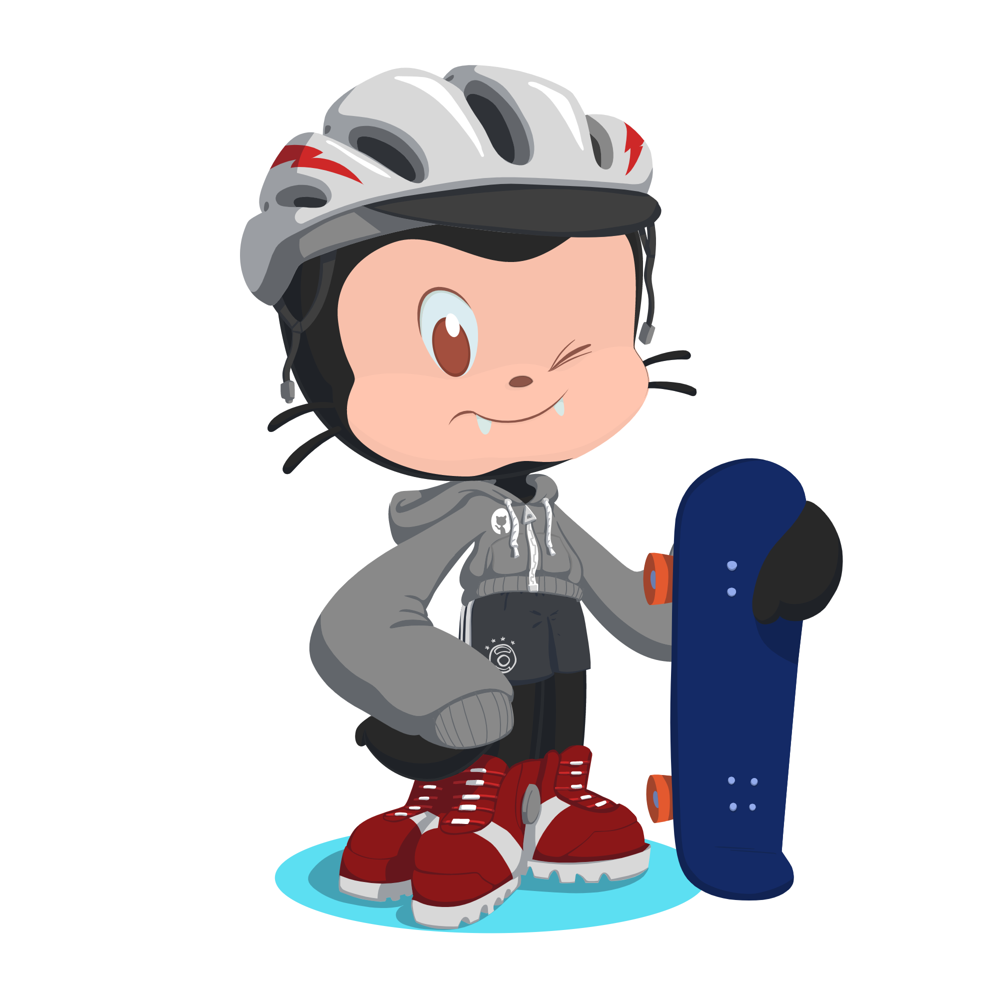

<!--
**ashen99/ashen99** is a ✨ _special_ ✨ repository because its `README.md` (this file) appears on your GitHub profile.

Here are some ideas to get you started:

- 🔭 I’m currently working on ...
- 🌱 I’m currently learning ...
- 👯 I’m looking to collaborate on ...
- 🤔 I’m looking for help with ...
- 💬 Ask me about ...
- 📫 How to reach me: ...
- 😄 Pronouns: ...
- ⚡ Fun fact: ...
-->
<!--  

 -->
<h1 align="center">Hi 👋, I'm Ashen Perera</h1>
<h3 align="center">A passionate Developer from SriLanka, I am dedicated to pushing the boundaries of technology and creating innovative solutions that address real-world challenges.</h3>

  

<!-- 
  
 -->

- 🔭 I work on **Full Stack Development, Mobile App Development, Deep Learning, UI/UX design, Java programming And Machine Learning** 

- 🌱 I’m currently learning **Springboot, Mobile Development**

- 👨‍💻 All of my projects are available at [https://ashenperera.netlify.app/](https://ashenperera.netlify.app/)

- 📫 Contact me via **ashaneperera1999@gmail.com**

- 📄 Know about my experiences [https://ashenperera.netlify.app/](https://ashenperera.netlify.app/)

- ⚡ Fun fact **If didn't become a developer, I definitely would have become a digital artist.**

<h3 align="left">Connect with me:</h3>

<h3 align="left">Languages and Tools:</h3>

